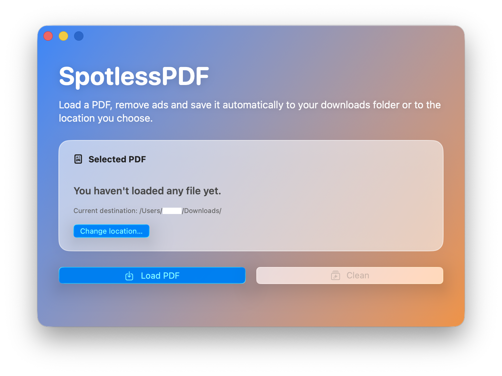
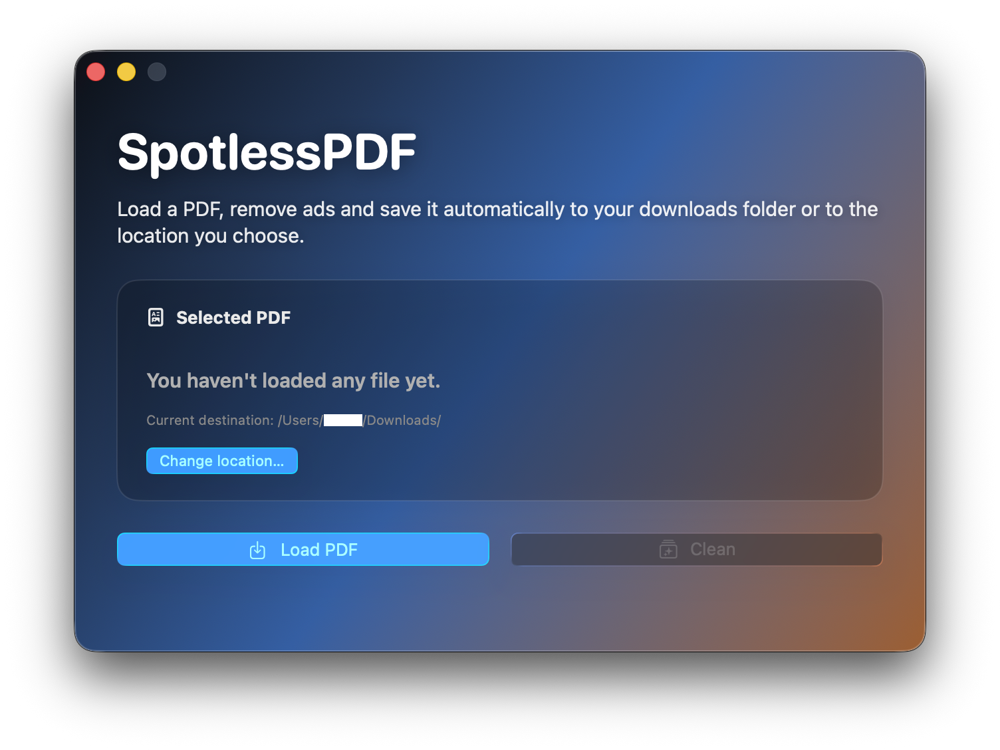

# SpotlessPDF

  
  

## Overview

SpotlessPDF is an open-source macOS desktop application that lets users clean ads from PDF files entirely on-device through a simple native interface. It wraps a Rust-based cleaning engine in a SwiftUI/AppKit app designed to make local PDF cleaning easier and more accessible than relying on an external web service. **33 languages supported.**

## Installation

1. Download **Simula3MS-Swift.zip** from the latest release.
2. If the file is not already uncompressed, double-click the `.zip` to extract it.
3. Drag **Simula3MS-Swift.app** into the **Applications** folder.

> [!IMPORTANT]
> If macOS blocks the app on first launch, open **System Settings → Privacy & Security** and click **Open Anyway**.

## Credits

The Rust PDF cleaning engine is based on gulagcleaner by YM162:
https://github.com/YM162/gulagcleaner

## License

This project is distributed under the GNU General Public License v3.0.
